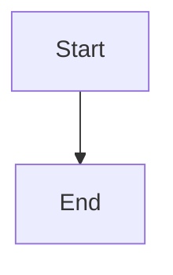
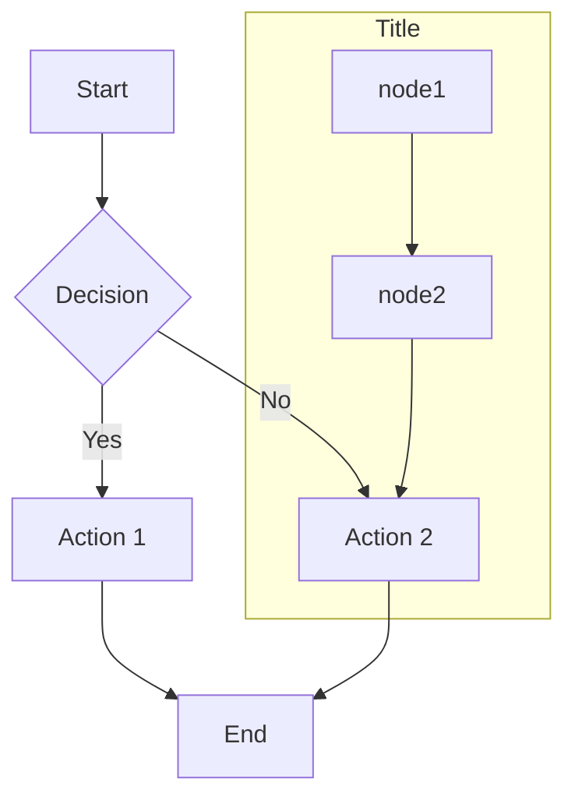
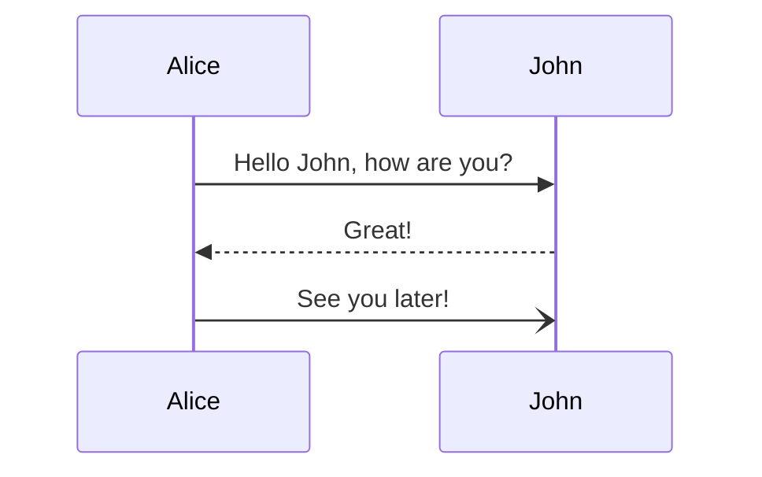
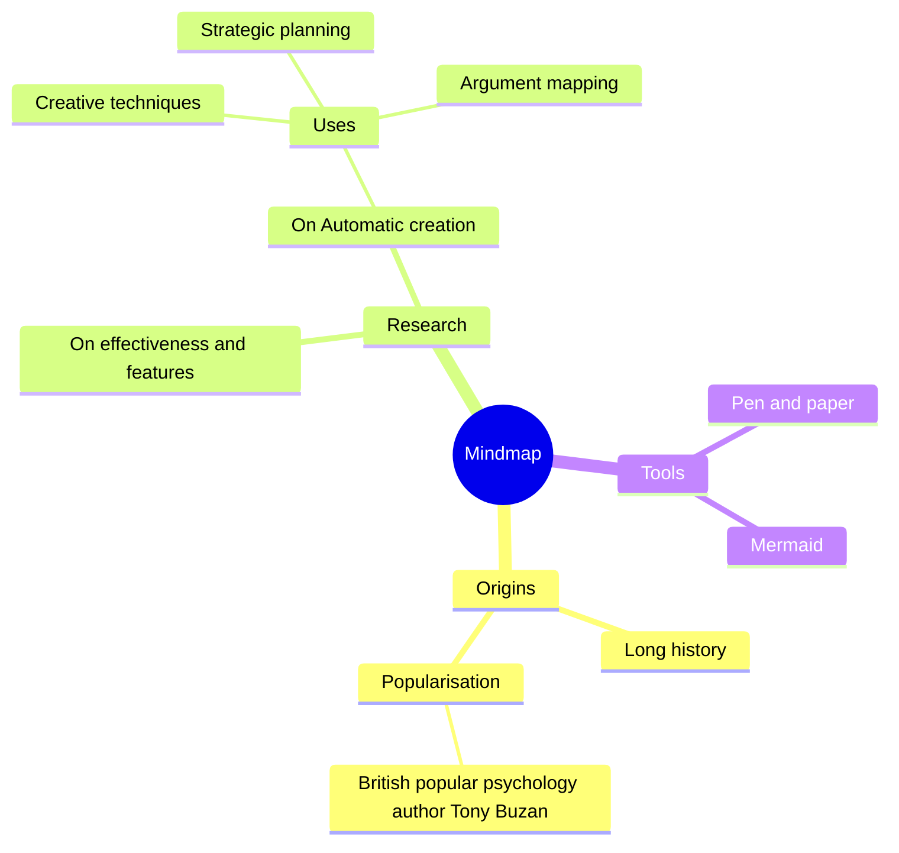
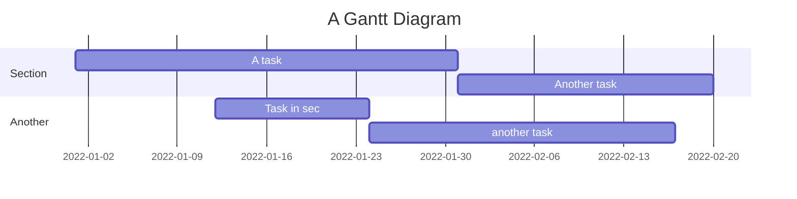
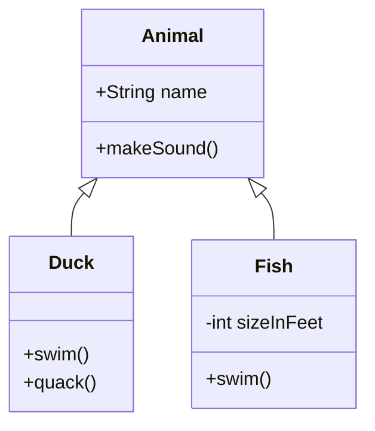
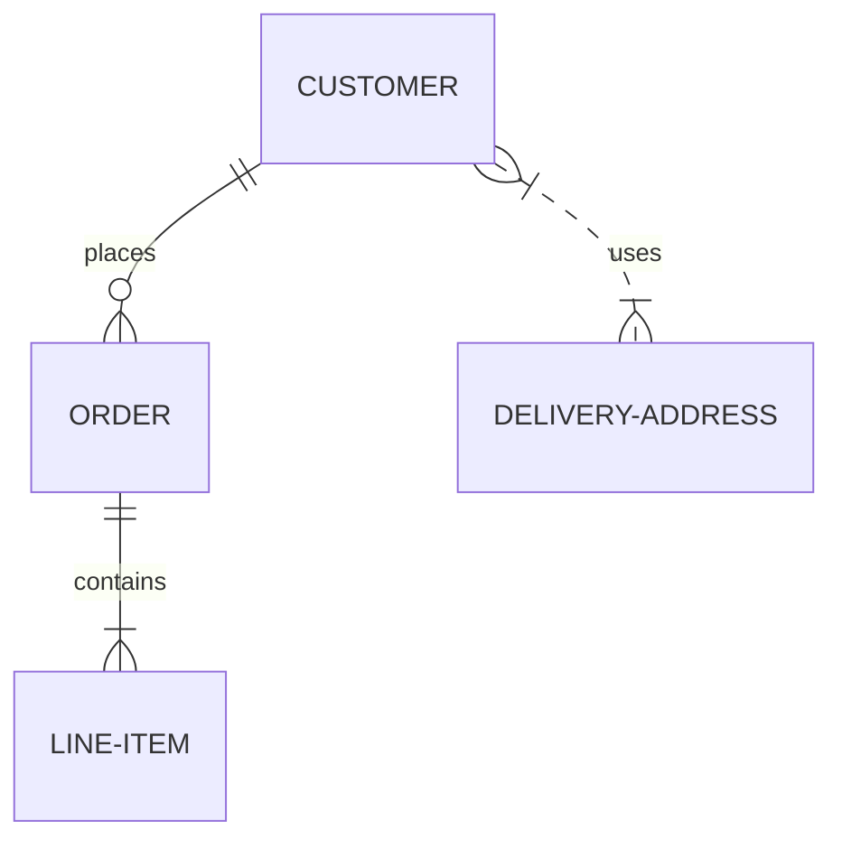
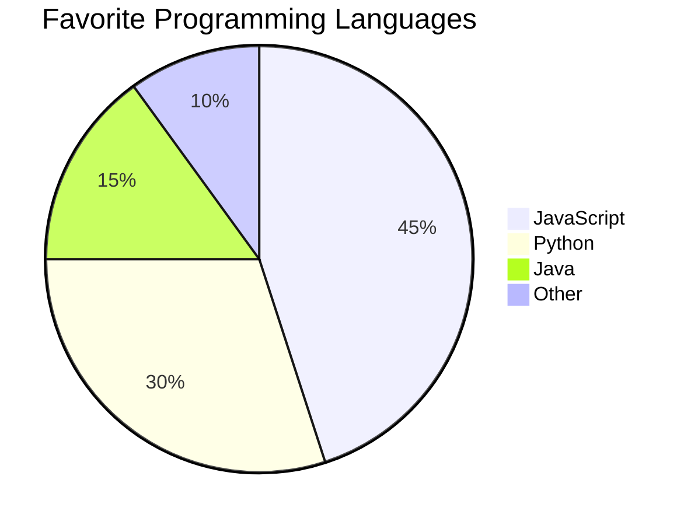

# 📊 Mermaid Diagram Guide

Mermaid is a JavaScript-based diagramming and charting tool that renders Markdown-inspired text definitions to create diagrams dynamically.

## Basic Syntax

To create a Mermaid diagram, use the following syntax in your Markdown:

```markdown
    ```mermaid
    graph TD
        A[Start] --> B[End]
    ```
```

Which renders as:

<div align="center">



</div>

## Diagram Types

### Flowcharts

**Example:**
    ```markdown
        ```mermaid
        graph TD
            A[Start] --> B{Decision}
            B -->|Yes| C[Action 1]
            B -->|No| D[Action 2]
            C --> E[End]
            D --> E
            subgraph Title
            node1 --> node2 --> D
            end
        ```
    ```

**Result:**

<div align="center">



</div>

!!! Syntax

    **Flowchart direction:**

    - `TD` - Top-down graph 
    - `LR` = left-right graph 

    **Node types:**

    - `A[Text]` - Rectangle
    - `B(Text)` - Rounded rectangle
    - `C((Text))` - Circle
    - `D{Text}` - Diamond/decision

    **Edge types:**

    - `-->` - Arrow
    - `--Text-->` - Arrow with text
    - `-.->` - Dotted arrow
    - `==>` - Thick arrow

    **Subgraphs:** **Start** with **"subgraph"** and **Close** with **"end"**
    ```
    subgraph Title
    node1 --> node2
    end
    ```

### Sequence Diagrams

**Example:**

```markdown
    ```mermaid
    sequenceDiagram
        Alice->>John: Hello John, how are you?
        John-->>Alice: Great!
        Alice-)John: See you later!
    ```
```

**Result:**

<div align="center">



</div>

!!! Syntax

    **Diagram declaration:**
    
    - `sequenceDiagram` - Declares a sequence diagram
    
    **Participants:**
    
    - `participant Alice` - Explicitly define participants
    - Automatically created from messages if not defined
    
    **Message types:**
    
    - `->>` - Solid arrow
    - `-->>` - Dotted arrow
    - `-)`- Open arrowhead
    - `--)`- Dotted open arrowhead

### Mindmaps

**Example:**

```markdown
    ```mermaid
    mindmap
    root((Mindmap))
        Origins
        Long history
        Popularisation
            British popular psychology author Tony Buzan
        Research
        On effectiveness and features
        On Automatic creation
            Uses
                Creative techniques
                Strategic planning
                Argument mapping
        Tools
        Pen and paper
        Mermaid
    ```
```

**Result:**

<div align="center">



</div>

!!! Syntax

    **Diagram declaration:**
    
    - `mindmap` - Starts a mindmap diagram
    
    **Structure:**
    
    - Use indentation to define hierarchy
    
    **Node types:**
    
    - Default: no shape
    - `(Text)` - Rounded rectangle
    - `((Text))` - Circle
    - `[Text]` - Square
    - `[[Text]]` - Rectangle

### Gantt Charts

**Example:**

```markdown
    ```mermaid
    gantt
        title A Gantt Diagram
        dateFormat YYYY-MM-DD
        section Section
        A task           :a1, 2022-01-01, 30d
        Another task     :after a1, 20d
        section Another
        Task in sec      :2022-01-12, 12d
        another task     :24d
    ```
```

**Result:**

<div align="center">



</div>

!!! Syntax

    **Diagram declaration:**
    
    - `gantt` - Declares a Gantt chart
    
    **Configuration:**
    
    - `dateFormat YYYY-MM-DD` - Sets date format
    - `title` - Sets chart title
    
    **Sections:**
    
    - `section [Name]` - Creates a section
    
    **Tasks:**
    
    - `Task name :id, YYYY-MM-DD, duration` - Task with ID
    - `Task name :after id, duration` - Dependent task

### Class Diagrams

**Example:**

```markdown
    ```mermaid
    classDiagram
        Animal <|-- Duck
        Animal <|-- Fish
        
        class Animal {
            +String name
            +makeSound()
        }
        class Duck {
            +swim()
            +quack()
        }
        class Fish {
            -int sizeInFeet
            +swim()
        }
    ```
```

**Result:**

<div align="center">



</div>

!!! Syntax

    **Diagram declaration:**
    
    - `classDiagram` - Declares a class diagram
    
    **Relationships:**
    
    - `<|--` - Inheritance
    - `*--` - Composition
    - `o--` - Aggregation
    - `-->` - Association
    - `--` - Link
    
    **Class definition:**
    
    - `class ClassName { members }` - Define class
    - `+` - Public member
    - `-` - Private member
    - `#` - Protected member

### Entity Relationship Diagrams

**Example:**

```markdown
    ```mermaid
    erDiagram
        CUSTOMER ||--o{ ORDER : places
        ORDER ||--|{ LINE-ITEM : contains
        CUSTOMER }|..|{ DELIVERY-ADDRESS : uses
    ```
```

**Result:**

<div align="center">



</div>

!!! Syntax

    **Diagram declaration:**
    
    - `erDiagram` - Declares an ER diagram
    
    **Relationships:**
    
    - `||--o{` - One-to-many
    - `}|--|{` - Many-to-many
    - `||--||` - One-to-one
    - `}|..|{` - Many-to-many (optional)
    
    **Labels:**
    
    - `Entity1 ||--o{ Entity2 : "label"` - Add description

### Pie Charts

**Example:**

```markdown
    ```mermaid
    pie title Favorite Programming Languages
        "JavaScript" : 45
        "Python" : 30
        "Java" : 15
        "Other" : 10
    ```
```

**Result:**

<div align="center">



</div>

!!! Syntax

    **Diagram declaration:**
    
    - `pie` - Declares a pie chart
    
    **Title:**
    
    - `title [Text]` - Sets chart title
    
    **Data:**
    
    - `"Label" : value` - Defines slices with values

## Tips for Creating Effective Diagrams

1. Keep diagrams simple and focused
2. Use consistent styling
3. Add clear labels for better understanding
4. Group related elements visually
5. Use colors purposefully
6. Consider the viewing context (screen size, etc.)
7. Test the readability of your diagram

## Further Resources

- [Official Mermaid Documentation](https://mermaid-js.github.io/mermaid/#/)
- [Mermaid Live Editor](https://mermaid.live/)
- [Mermaid CLI](https://github.com/mermaid-js/mermaid-cli)
- [Mermaid mkdocs plugin](https://github.com/fralau/mkdocs-mermaid2-plugin)